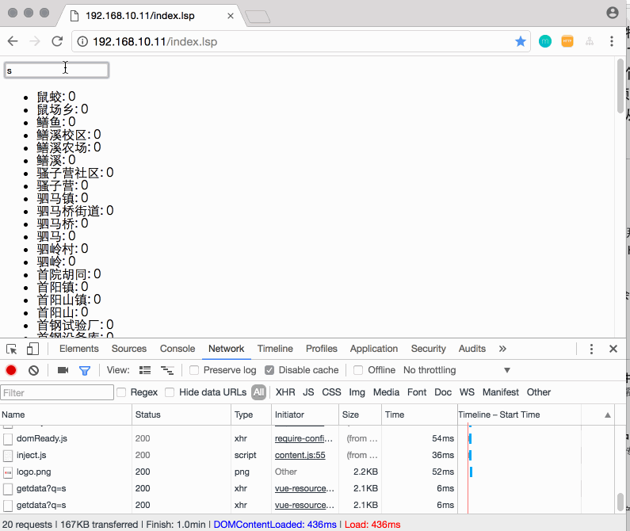
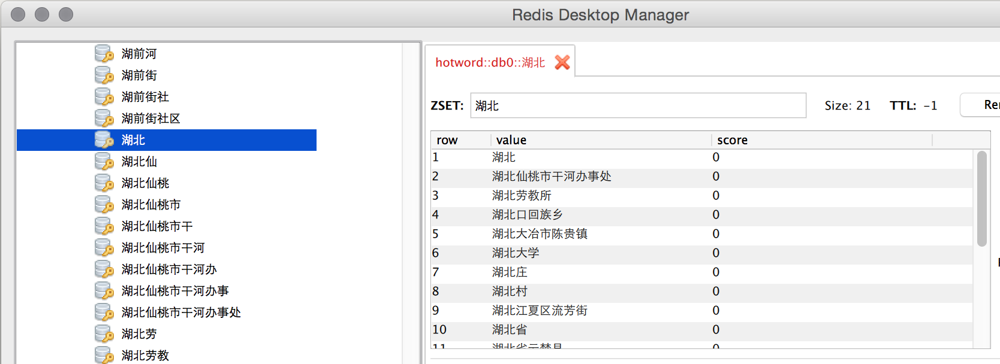
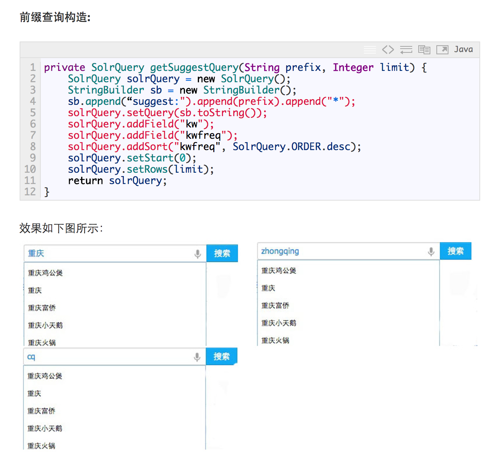
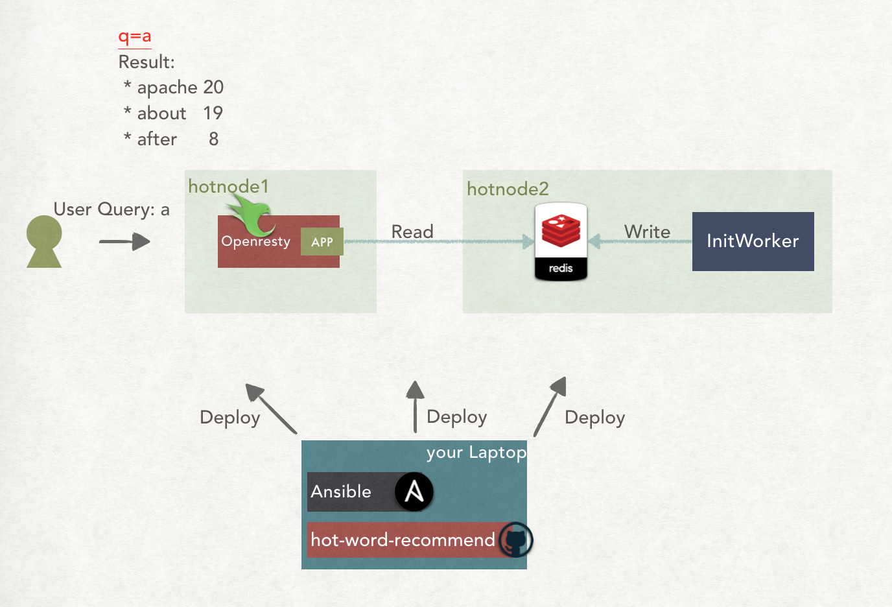

#### 为什么想做这个东西

一直好奇像亚马逊这类网站的搜索是如何做到推荐的，最近刚好看到一篇文章：[Redis 与搜索热词推荐](http://blog.jobbole.com/95780/)，然而只写了思路。所以，就是想自己实现一个。

先上个效果图，再聊：



P.S. 按四年前，要写这样的前端效果，对于我这个后台开发，还是挺困难的。而现在，简单的学了下Vue.js，再加上同事的小小指点，就搞定了。😂

#### 热词推荐的本质

假如你预先就知道了用户输入：s、sz、shen、深这些字时，就是想搜“深圳”，那是不是说，我们只要提前将这些字放到一个Map结构中，将用户的输入想像出一个key，value就是“深圳”。

说到底，热词推荐的本质就是一个大大的Map。**难点就在于如何更新这个Map**，以至于让用户觉得“智能”，或觉得我们在给他们做“推荐”。

这个Map，常常被人称为“索引”。其实使用“索引” 这个名词也更准确一些。Map中的Key是不能重复的。但是我们数据结构是要求可重复的，为什么呢？因为，在系统中，s、sh、shen、深等等这些都是key，而它们对应的value，可能相同，又可能不同。举个例子：

```
hotword:0>zrevrange s 0 10
1) 鼠蛟
2) 鼠场乡
3) 鳝鱼
4) 鳝溪校区
5) 鳝溪农场
6) 鳝溪
7) 骚子营社区
8) 骚子营
9) 驷马镇
10) 驷马桥街道
11) 驷马桥
```

```
hotword:0>zrevrange sh 0 10
1) 鼠蛟
2) 鼠场乡
3) 鳝鱼
4) 鳝溪校区
5) 鳝溪农场
6) 鳝溪
7) 首院胡同
8) 首阳镇
9) 首阳山镇
10) 首阳山
11) 首钢试验厂
```

仔细看到其中的不同了吗？同时，这里还有一个问题，那就是当用户输入s时，出现了10个value，我们如何给这些value如何排序呢？

为了与排序模型解耦，我们为每个value都给出一个分数score。score越大，越排前面。最终索引结构就变成了这样子：



P.S. 这些score之所以都为0，是因为数据问题。

总的来说，关于热词推荐，我们需要解决以下问题：

* 如何存储索引的数据？

* 如何构建索引？也就是一开始时，我们怎么知道用户输入“s” 就是要搜“深圳”呢？

* 如何根据用户的反馈行为来更新索引？当用户输入 “s” 出现了“1 沙河”和“2 深圳”，用户选择了“深圳”，那么当其他用户输入“s”时，我们是不是应该将“深圳”这个词放到前面呢？

  ​

  ​

#### 基于Solr实现的弊端

 美团在几年前也写了一篇文章来介绍自己的热词推荐：[搜索引擎关键字智能提示的一种实现](http://blog.jobbole.com/95802/)。然而这种实现，个人觉得有个设计非常不好。因为Solr在整个系统中，即做了“存储索引”的角色，又做了“构建索引”的角色。违反了职责单一原则。因为当我们想改变构建索引的算法时，同时会影响到“存储索引”的逻辑。

以下是他们的实现逻辑截图：



#### 另一种基于Redis的实现

我目前只写了一个简单实现，而且还没有实现“根据用户反馈来更新索引”的功能。这个功能可实现得很简单，也可以实现得很复杂。本文不讨论。

同时，生产环境会更复杂一些。比如要实现高可用。我个人能力有限，还没有能实现。但是思路是有的：所有出现单点的地方都要做成分布式的，比如Redis就做成Redis Cluster。

以下是架构图：



图中，InitWorker负责将我准备好的全国地名大全的数据，构建成索引，然后写到Redis中。用户则可以通过基于Openresty写的APP去查询Redis中的数据。

使用本系统的方法：

> P.S. 本系统使用Ansible做自动化部署，所以，请提前安装好Ansible。

1. git clone https://github.com/zacker330/hot-word-recommend.git
2. 准备两个Ubuntu 16的机器，如果你懂Vagrant的话，直接使用我的Vagrantfile就好了
3. 进入到项目中，执行`ansible-playbook ./ansible/playbook.yml -i ./ansible/inventory -u vagrant -k` 来自动化部署所有组件。如果使用Vagrant来搭建的环境，密码是 vagrant，以下同，将不在重述。
4. 打包我们的InitWorker项目：`mvn assembly:assembly`
5. 部署InitWorker: `ansible-playbook ./ansible/deploy-worker.yml -i ./ansible/inventory -u vagrant -k`
6. 打开链接测试：http://192.168.10.11/index.lsp 。IP换成你自己部署的机器的IP。

具体代码，自己看了。为方便阅读，我觉得有必要注释一下项目结构：

```
├── README.md
├── Vagrantfile
├── ansible
│   ├── deploy-front-app.yml // 单独部署 前端app
│   ├── deploy-local.yml //本地开发使用
│   ├── deploy-worker.yml // 执行worker，写索引到redis中
│   ├── inventory
│   ├── playbook.yml // 安装所有必要的组件
│   ├── roles
│   │   ├── common
│   │   ├── front-app // 安装前端APP
│   │   ├── jdk8 // 安装Jdk8
│   │   ├── openresty // 安装Openresty
│   │   └── redis // 安装redis的脚本
│   └── vars
│       └── base-env.yml  // 配置变量存放文件
├── autocomplete-worker
│   ├── pom.xml
│   ├── src
│   │   ├── main
│   │   │   ├── java
│   │   │   │   └── codes
│   │   │   │       └── showme
│   │   │   │           └── autocomplete
│   │   │   │               ├── InitWorker.java    
│   │   │   │               └── common
│   │   │   └── resources
│   │   │       └── env.properties
│   │   └── test
│   └── target
├── doc // 文档需要用到的一些文件
└── files
    └── places.txt.zip  //全国地名数据
```


#### 小结

热词推荐的“智能”所在处就在于索引的构建算法。简单一点的做法就是每当用户点击某搜索结果时，我们就给这个索引条目加权1。感兴趣的同学可以实现来玩玩。

以上内容均为个人看法，如果有不对的地方，还请斧正，谢谢了。